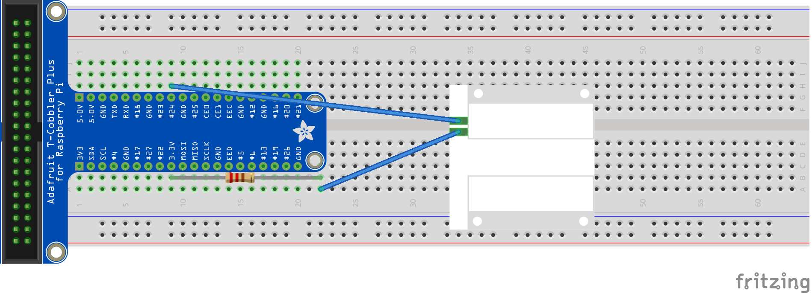

# PiDoorSensor

Are you tired of your roommates not knocking on your door and surprising you? Say no more!

# How to set up

## You will need

1. Raspberry Pi Zero W
2. Adafruit Door Sensor
3. 220Ω Resistor

## Setting up the pi

1. [Install Java 11](https://pi4j.com/documentation/java-installation/#with-armv6-processor)
2. Download the RaspberryPi.jar file from releases and put it on your Pi

## Wire it up


## Run it
```shell
java -jar RaspberryPi.jar [gpio_number]
```

## Setting up the client
1. [Install Java 17](https://www.oracle.com/java/technologies/javase/jdk17-archive-downloads.html)
2. Download the Client.jar file from releases

## Run it
```shell
java -jar Client.jar <pi_address>
```